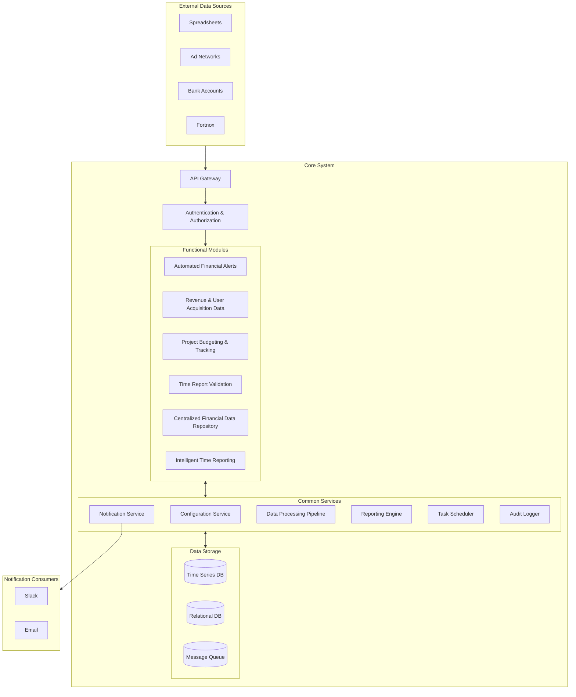

```mermaid
flowchart TB
    subgraph External ["External Data Sources"]
        Spreadsheets[Spreadsheets]
        AdNetworks[Ad Networks]
        BankAccounts[Bank Accounts]
        Fortnox[Fortnox]
    end

    subgraph Core ["Core System"]
        API[API Gateway]
        Auth[Authentication & Authorization]
        
        subgraph Modules ["Functional Modules"]
            AlertSystem[Automated Financial Alerts]
            RevenueAutomation[Revenue & User Acquisition Data]
            BudgetTracking[Project Budgeting & Tracking]
            TimeValidation[Time Report Validation]
            DataRepo[Centralized Financial Data Repository]
            TimeReporting[Intelligent Time Reporting]
        end
        
        subgraph Common ["Common Services"]
            ConfigService[Configuration Service]
            NotificationService[Notification Service]
            DataProcessing[Data Processing Pipeline]
            Reporting[Reporting Engine]
            Scheduler[Task Scheduler]
            AuditLogger[Audit Logger]
        end
        
        subgraph Storage ["Data Storage"]
            MetricsDB[(Time Series DB)]
            MainDB[(Relational DB)]
            Queue[(Message Queue)]
        end
    end
    
    subgraph Consumers ["Notification Consumers"]
        Slack[Slack]
        Email[Email]
    end
    
    %% Connections
    External --> API
    API --> Auth
    Auth --> Modules
    Modules <--> Common
    Common <--> Storage
    NotificationService --> Consumers
```